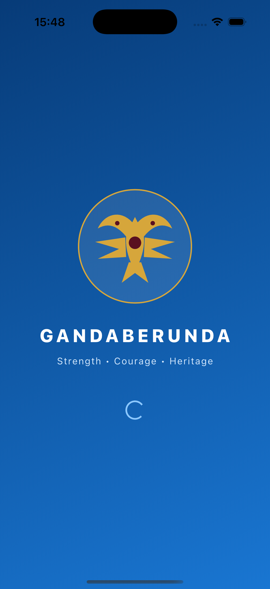
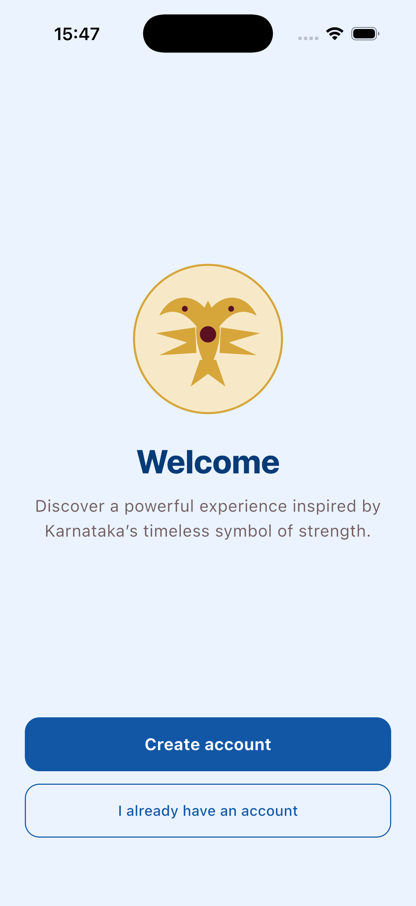

<div align="center">

# 🦅 Gandaberunda

### Strength • Courage • Heritage

A modern Flutter application inspired by Karnataka's legendary two-headed
Gandaberunda—built to bring heritage, community, events, and stories together
in one welcoming mobile experience.

[](https://flutter.dev)
[](https://dart.dev)
[](https://m3.material.io/)
[](#-contributing)

</div>

---

## ✨ About the project

Gandaberunda is a Flutter mobile app that celebrates the identity and heritage
of Karnataka through a clean, accessible Material 3 interface. Users can create
a local account, sign in securely, discover cultural content, browse community
features, and manage their profile.

The project is also a practical example of building a multi-screen Flutter app
with form validation, navigation, reusable widgets, local persistence, and
responsive UI.

## 📱 App preview

<div align="center">
  
  &nbsp;&nbsp;
  
</div>

<p align="center">
  <sub>Splash screen and welcome experience running on an iPhone simulator.</sub>
</p>

## 🚀 Features

- Animated branded splash and welcoming onboarding experience
- Account registration with input validation
- Secure local login with SHA-256 password hashing
- SQLite-powered local user storage
- Personalized home dashboard with quick-access cards
- Heritage, events, stories, and community discovery interface
- Profile overview and profile editing
- Material 3 design with a Karnataka-inspired blue and gold palette
- Reusable custom-painted Gandaberunda emblem

## 🛠️ Built with

| Technology | Purpose |
| --- | --- |
| [Flutter](https://flutter.dev) | Cross-platform application framework |
| [Dart](https://dart.dev) | Application language |
| [sqflite](https://pub.dev/packages/sqflite) | Local SQLite database |
| [crypto](https://pub.dev/packages/crypto) | Password hashing |
| [path](https://pub.dev/packages/path) | Platform-safe database paths |
| Material 3 | Components, theming, and responsive UI |

## 🗂️ Project structure

```text
lib/
├── data/
│   └── user_database.dart   # SQLite registration and login
├── models/
│   └── app_user.dart        # User data model
├── app.dart                 # Screens, navigation, theme, and widgets
└── main.dart                # Application entry point

docs/
└── screenshots/             # Images displayed in this README
```

## ⚡ Getting started

### Prerequisites

- [Flutter SDK](https://docs.flutter.dev/get-started/install) 3.44 or newer
- Dart 3.12 or newer
- Android Studio or Xcode for a mobile simulator/device

### Installation

```bash
git clone https://github.com/SRIHARSHA2108/flutter-application.git
cd flutter-application
flutter pub get
flutter run
```

To choose a specific device:

```bash
flutter devices
flutter run -d <device-id>
```

## ✅ Quality checks

Run these before submitting a change:

```bash
flutter analyze
flutter test
dart format --set-exit-if-changed .
```

## 🤝 Contributing

Contributions, ideas, and bug reports are welcome!

1. Fork this repository.
2. Create a branch: `git checkout -b feature/your-feature-name`
3. Make your changes and add or update tests.
4. Run the quality checks listed above.
5. Commit your work: `git commit -m "Add your feature"`
6. Push the branch: `git push origin feature/your-feature-name`
7. Open a pull request describing what changed and why.

Please keep changes focused, follow the existing Dart style, and include
screenshots when a pull request changes the user interface.

## 🗺️ Ideas for future development

- Remote authentication and cloud synchronization
- Rich heritage articles and multilingual content
- Search filters and saved discoveries
- Community posts and event registration
- Password recovery flow
- Expanded widget and integration test coverage

## 🙌 Support

If you find this project useful, consider giving the repository a ⭐. For bugs
or feature ideas, [open an issue](https://github.com/SRIHARSHA2108/flutter-application/issues).

---

<div align="center">
  Made with 💙 using Flutter
</div>
